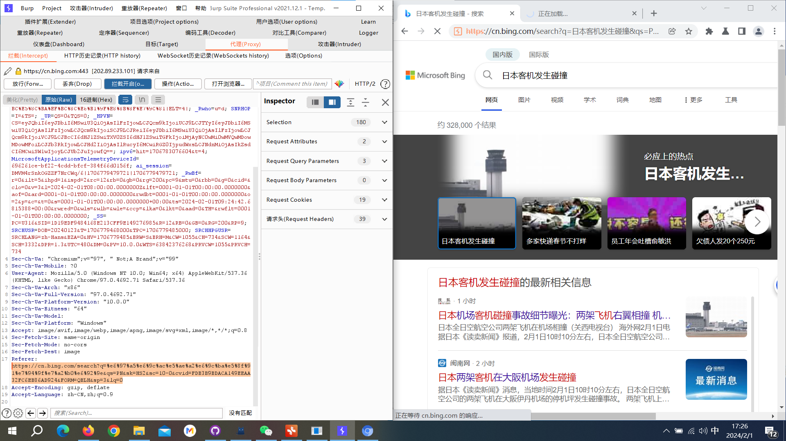
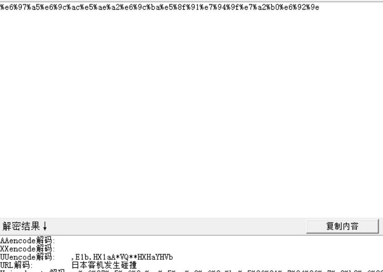
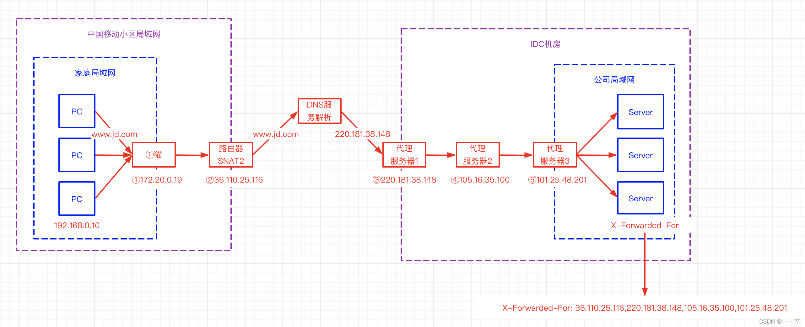
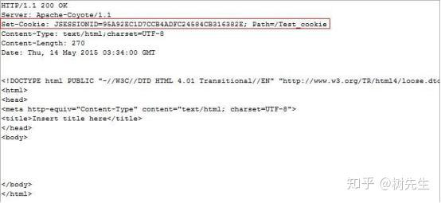
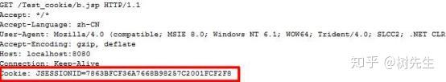

# 基础信息

## HTTP

### HTTP 报文

#### [HTTP 介绍](https://www.jianshu.com/p/3b02648d405b)

请求报文包括三部分:

```
请求行：包含请求方法,URI,HTTP版本协议

请求头：请求首部字段

请求正文：请求内容实体
```

响应报文包含三部分:

```
状态行：包含HTTP版本,状态码,状态码原因短语

响应头：响应首部字段

响应正文：响应内容实体
```

#### HTTP 通用头域

##### Cache-Control头域

 Cache-Control指定请求和响应遵循的缓存机制。在请求消息或响应消息中设置`Cache-Control`并不会修改另一个消息处理过程中的缓存处理过程。请求时的缓存指令包括`no-cache、no-store、max-age、max-stale、min-fresh、only-if-cached`，响应消息中的指令包括`public、private、no-cache、no-store、no-transform、must-revalidate、proxy-revalidate、max-age`

##### Date头域

 Date头域表示消息发送的时间，时间的描述格式由`rfc822`定义。例如，`Date:Mon,31Dec200104:25:57GMT`。Date描述的时间表示世界标准时，换算成本地时间，需要知道用户所在的时区。

##### Pragma头域

Pragma头域用来包含实现特定的指令，最常用的是`Pragma:no-cache`。在HTTP/1.1协议中，它的含义和`Cache-Control:no-cache`相同。

#### HTTP 请求消息

GET和HEAD应该被所有的通用WEB服务器支持，其他所有方法的实现是可选的。GET方法取回由Request-URI标识的信息。HEAD方法也是取回由Request-URI标识的信息，只是可以在响应时，不返回消息体。

POST方法可以请求服务器接收包含在请求中的实体信息，可以用于提交表单，向新闻组、BBS、邮件群组和数据库发送消息。

***

### HTTP头

#### Referer

##### [Referer 介绍](https://www.ruanyifeng.com/blog/2019/06/http-referer.html)

HTTP 请求的头信息里面，Referer是一个常见字段，提供访问来源的信息，给出"引荐网页"的 URL。即你是从哪里来到的此网页 

比如说这个网页



他的Referer就是

```
Referer: https://cn.bing.com/search?q=%e6%97%a5%e6%9c%ac%e5%ae%a2%e6%9c%ba%e5%8f%91%e7%94%9f%e7%a2%b0%e6%92%9e&qs=PN&sk=HS2&sc=10-0&cvid=FDB3B9BDACA149EEAA32FC6EB86AD924&FORM=QBLH&sp=3&lq=0
```

通过`https://cn.bing.com/`进行`search`

搜索的是什么，是

```
q=%e6%97%a5%e6%9c%ac%e5%ae%a2%e6%9c%ba%e5%8f%91%e7%94%9f%e7%a2%b0%e6%92%9e
```

经过解码就是日本客机发生碰撞



这就是Referer提供的信息

##### Referer 发生场景

浏览器向服务器请求资源的时候，`Referer`字段的逻辑是这样的，用户在地址栏输入网址，或者选中浏览器书签，就不发送`Referer`字段。

主要是以下三种场景，会发送`Referer`字段。

（1）用户点击网页上的链接。

（2）用户发送表单。

（3）网页加载静态资源，比如加载图片、脚本、样式。

##### Referer 信息泄露

举两个例子，一个是功能 URL，即有的 URL 不要登录，可以访问某个管理系统，就能直接完成密码重置、邮件退订等功能。另一个是内网 URL，不希望外部用户知道内网有这样的地址。`Referer`字段很可能把这些 URL 暴露出去。

##### Referer 伪造

一个典型的应用是，有些网站不允许图片外链，只有自家的网站才能显示图片，外部网站加载图片就会报错。它的实现就是基于`Referer`字段，如果该字段的网址是自家网址，就放行。

我们就可以利用这一特性进行伪造`Referer`以达到访问某些网站的目的

***

#### X-Forwarded-For

##### [X-Forwarded-For 介绍](https://developer.mozilla.org/zh-CN/docs/Web/HTTP/Headers/X-Forwarded-For)

X-Forwarded-For(XFF)是一个 HTTP 扩展头部,用来表示 HTTP 请求端真实 IP，当客户端直接连接到服务器时，其 IP 地址被发送给服务器（并且经常被记录在服务器的访问日志中）。但是如果客户端通过正向或反向代理服务器进行连接，服务器就只能看到最后一个代理服务器的 IP 地址，这个 IP 通常没什么用。如果最后一个代理服务器是与服务器安装在同一台主机上的负载均衡服务器，则更是如此。`X-Forwarded-For` 的出现，就是为了向服务器提供更有用的客户端 IP 地址。

##### X-Forwarded-For 请求格式

X-Forwarded-For 请求头格式非常简单，就这样：

```
X-Forwarded-For: client, proxy1, proxy2
```

可以看到，XFF 的内容由「英文逗号 + 空格」隔开的多个部分组成，最开始的是离服务端最远的设备 IP，然后是每一级代理设备的 IP。

如果一个 HTTP 请求到达服务器之前，经过了三个代理 Proxy1、Proxy2、Proxy3，IP 分别为 IP1、IP2、IP3，用户真实 IP 为 IP0，那么按照 XFF 标准，服务端最终会收到以下信息：

```
X-Forwarded-For: IP0, IP1, IP2
```

如图



```
X-Forwarded-For: 36.110.25.116,220.181.38.148,105.16.35.100,101.25.48.201

                     客户端IP      proxy-ip      proxy-ip       proxy-ip
```

##### X-Forwarded-For 信息泄露

通过查看X-Forwarded-For信息，就可以获得用户的真实ip地址

##### X-Forwarded-For ip伪造

X-Forwarded-For 作为 HTTP 请求的扩展头，在请求的过程中可以被直接的进行修改。正常情况下，我们所获得的 X-Forwarded-For，第一部分应该是客户端 iP，但是如果客户端对 X-Forwarded-For 进行了修改，我们仍旧采用以上方法获得客户端 IP，那么客户端 IP 将会是被伪造过的。

通常一些网站的防注入功能会记录请求端真实IP地址并写入数据库或某文件[通过修改XXF头可以实现伪造IP

###### X-Forwarded-For 注入

XFF注入属于SQL注入的一种，该注入原理是通过修改X-Forwarded-for头对带入系统的dns进行sql注入，达到欺骗服务器执行恶意的SQL命令的效果，从而可以得到网站的数据库内容。

***

#### User-Agent

##### [User-Agent 介绍](https://blog.csdn.net/Ssuper_X/article/details/109694479)

向服务器发送，包含了访问者系统引擎版本、浏览器信息的字段信息。一般服务器识别出是爬虫请求，会拒绝访问。所以此时设置User-Agent，可以将爬虫伪装成用户通过浏览器访问。

##### User-Agent 组成解释：

```
User-Agent: Mozilla/5.0 (Windows NT 10.0; Win64; x64) AppleWebKit/537.36 (KHTML, like Gecko) Chrome/86.0.4240.111 Safari/537.36
组成：
User-Agent: Mozilla/5.0 (平台) 引擎版本 浏览器版本号
```

##### [User-Agent 列表](https://www.cnblogs.com/adolfmc/p/12052468.html)：

```
Firefox
Mozilla/5.0 (Windows NT 6.2; WOW64; rv:21.0) Gecko/20100101 Firefox/21.0

Chrome on Windows 	
Mozilla/5.0 (Windows NT 6.2; WOW64) AppleWebKit/537.36 (KHTML, like Gecko) Chrome/27.0.1453.94 Safari/537.36

edge
Mozilla/5.0 (Windows NT 10.0; Win64; x64) AppleWebKit/537.36 (KHTML, like Gecko) Chrome/121.0.0.0 Safari/537.36 Edg/121.0.0.0

```

##### User-Agent 信息泄露：

通过查看网站的User-Agent，可以判别用户所使用的系统、浏览器等

##### User-Agent 伪造：

我们的爬虫程序，实际上是模拟浏览器对服务器发送请求来获取数据的。
在向服务器发送的网络请求中，User-Agent是客户端用于表明身份的一种标识。所以，反爬虫工程师可以将一些爬虫程序的请求头放入服务器访问的黑名单中，当有网络请求时通过检测User-Agent请求头域值来判断客户端的类型，将其与黑名单中数据进行比对，一致时则拒绝其访问，从而有效的限制一些爬虫程序。

User-Agent请求头域的值是可以修改的。Requests.get（）请求中有一个headers参数，可以将我们修改后的User-Agent加入，然后将爬虫程序伪装成浏览器，以此来骗过反爬虫程序。在爬虫中进行request请求，很多时候，都需要添加请求头，不然服务器会认为是非法的请求，从而拒绝你的访问。

***

#### Cookie

##### Cookie 介绍

cookie，是服务端保存在浏览器端的数据片段

一般情况下，cookie是以键值对进行表示的(key-value)，例如name=jack，这个就表示cookie的名字是name，cookie携带的值是jack。

Cookie 像是服务器发给浏览器的一张“会员卡”，浏览器每次向服务器发送请求时都会带着这张“会员卡”，当服务器看到这张“会员卡”时就可以识别浏览器的身份。实际上这个所谓的“会员卡”就是服务器发送的一个响应头：



如图 Set-Cookie 这个响应头就是服务器在向服务器发“会员卡”，这个响应头的名字是 `Set-Cookie `， 后 边 `JSESSIONID=95A92EC1D7CCB4ADFC24584CB316382E` 和 `Path=/Test_cookie`，是两组键值对的结构就是服务器为这个“会员卡”设置的信息。浏览器收到该信息后就会将它保存到内存或硬盘中。

当浏览器再次向服务器发送请求时就会携带这个 Cookie 信息



##### Cookie 生命周期

cookie有2种存储方式，一种是会话性，一种是持久性。

会话性：如果cookie为会话性，那么cookie仅会保存在客户端的内存中，当我们关闭客服端时cookie也就失效了
持久性：如果cookie为持久性，那么cookie会保存在用户的硬盘中，直至生存期结束或者用户主动将其销毁。

##### Cookie 信息泄露

有时候网站会在cookie里泄露管理员的账户密码或者其他隐私信息

##### Cookie 伪造

利用cookie我们就可以实现自动登录，保存游览历史，身份验证等功能。

例如：我们在不知道管理员账号密码情况下，我们知道了管理员登陆后的cookie，我们就可以利用这段cookie进行登录。

###### [伪造JWT](https://blog.csdn.net/Top_L398/article/details/109361680)

  JSON Web Token（JSON Web令牌）存储在cookie中，是一个开放标准(rfc7519)，它定义了一种紧凑的、自包含的方式，用于在各方之间以JSON对象安全地传输信息。此信息可以验证和信任，因为它是数字签名的。jwt可以使用秘密〈使用HNAC算法）或使用RSA或ECDSA的公钥/私钥对进行签名。

通过JSON形式作为Web应用中的令牌，用于在各方之间安全地将信息作为JSON对象传输。在数据传输过程中还可以完成数据加密、签名等相关处理

实战：[polar靶场web简单部分JWT](https://www.polarctf.com/#/page/challenges)

***

### [HTTP响应码](https://www.runoob.com/http/http-status-codes.html)

```
200：请求被正常处理
204：请求被受理但没有资源可以返回
206：客户端只是请求资源的一部分，服务器只对请求的部分资源执行GET方法，相应报文中通过Content-Range指定范围的资源。
301：永久性重定向
302：临时重定向
303：与302状态码有相似功能，只是它希望客户端在请求一个URI的时候，能通过GET方法重定向到另一个URI上
304：发送附带条件的请求时，条件不满足时返回，与重定向无关
307：临时重定向，与302类似，只是强制要求使用POST方法
400：请求报文语法有误，服务器无法识别
401：请求需要认证
403：请求的对应资源禁止被访问
404：服务器无法找到对应资源
500：服务器内部错误
503：服务器正忙
```

***

### HTTP 网页内容

在网页中会有大量的数据可供我们分析收集，重点留意用户名、账号、数字、邮箱等等敏感字眼，我们要留意进行分析

## URL参数

### URL 通用格式

```
<协议>：//<用户名>：<密码>@<主机域名或者ip地址>：<端口号>/<路径>；<参数>？<查询>#<片段>
```

最重要的是<协议><主机域名><路径>

### URL 格式解析

```
http://kali：kali@www.baidu.com:80/main/index.html；type=a；color=b？name=bob&id=123#main
```

协议http，主机域名`www.baidu.com`，资源路径/main/index.html

#### URL 协议

http（超文本传输协议）

ftp（文件传输协议）

rtsp（实时流传输协议）

telnet（远程登陆访问）等。

每个协议都遵循上述格式，只是有些协议的一些部分没有，如telnet协议就没有<参数>，<查询>，<片段>这几部分。

其中http也可以写做HTTP，大小写不影响

#### URL 用户名和密码

例子中的用户名和密码是kali：kali。比如我们使用ftp协议传输时就需要输入用户名和密码，但是我们的http协议中，如果把用户名和密码就放在url里，那很不安全，所以一般放在cookie里，这里就不详细说了，总之就是不经常使用。

#### URL 主机域名或者ip地址、端口

例子中的主机域名和端口是`www.baidu.com：80`，http协议的默认端口是80，端口就是开放服务的地方

#### URL 路径

路径就是文件路径，和我们文件管理器的命名方法一样，就是\ /不一样

路径就是`/main/index.html`

#### URL 参数

参数（params）一般使用“；”与路径分开，如果有多个参数也使用“；”分隔开。例子中的参数有两个，分别是type和color；type=a；color=b

我们访问一些资源，只有路径端口是不够的，有时候需要向解析url的应用程序提供参数才能去访问资源，如参数可能会定义传输格式等等。

#### URL 查询

查询（query）使用“？”与前边的东西分开，如果有多个查询的问题，需要使用“&”连接。

访问一些资源时，有些需要查询数据库进行搜索来缩小请求资源范围，就像我们查东西时指定关键字一样，例子中的查询语句是？name=bob&id=123

意思是，在该路径下，查询name=bob，id=123的资源。

## 审查元素

### 审查元素介绍

看到的就是最终的html代码。即：源代码 + 网页js渲染 。

在源代码中找不到的代码，是在浏览器执行js动态生成的。

当我们在爬虫时需要对js在加载的数据进行爬取时，就不能像普通爬虫一样进行获取了，这时通常有**两种方法**：

```
通过selenum自动化技术

通过在页面上进行抓包，获取js链接以及表单元素进行请求
```

### [JS敏感信息泄露](https://zhuanlan.zhihu.com/p/51176109)

比如通过JS泄露敏感信息，攻击者不仅可以轻松收集用户手机号，姓名等隐私信息，更可以借此攻入企业后台甚至是getshell

#### JS文件泄露后台管理敏感路径及API

#### 页面内JS泄露http-only保护的cookie

#### 页面内JS以及AJAX请求泄露用户敏感信息

## 检查网页源代码

别人服务器发送到浏览器的原封不动的代码，也就是最原始的代码。

有些源代码中可能会有敏感信息泄露

