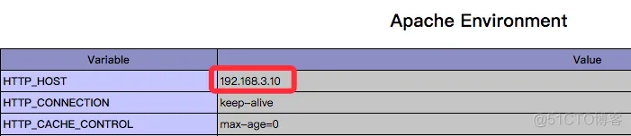
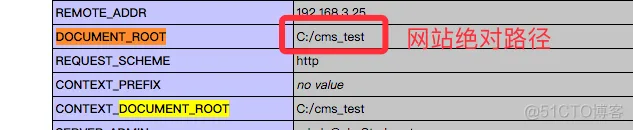
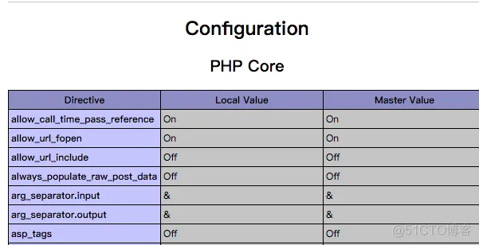

# 敏感信息

## phpinfo

### phpinfo 描述

Phpinfo函数信息泄露漏洞常发生一些默认的安装包，比如php study等，默认安装完成后，没有及时删除这些提供环境测试的文件，比较常见的为phpinfo.php、1.php和test.php，虽然通过phpinfo获取的php环境以及变量等信息，但这些信息的泄露配合一些其它漏洞将有可能导致系统被渗透和提权。

phpinfo()函数返回的信息中包含了服务器的配置信息，包括：

```
1）PHP编译选项以及文件扩展名的相关信息；

2）php的版本信息

3）php的配置信息；

4）数据库信息；等敏感信息。这些敏感信息会帮助攻击者展开进一步的攻击。
```

### phpinfo 检测方法

如果网站存在该漏洞，通常通过扫描工具进行扫描可得到链接。

### [phpinfo 信息泄露](https://blog.51cto.com/z2ppp/2063173)

#### 操作系统版本


#### 网站真实ip

当网站使用cdn或群集时，那么该文件会显示网站真实ip地址
 

#### 网站路径

当网站绝对路径泄漏时，如果能写webshell，则可以直接getshell；

当日志文件路径泄露时，如果存在文件包含，则直接包含日志文件getshell
 

#### 应用信息

通过phpinfo可以查看到支持的特殊服务，例如:redis、fastcgi、memcache、ImageMagick等。

如果存在redis、memcache等则可尝试未授权访问获取信息
如果存在fastcgi，则可尝试远程代码执行
如果使用了ImageMagick，则可根据版本尝试远程代码执行

#### 一些敏感配置



#### php版本信息

php版本信息，每个php版本都有变化和特性，像php5.3.4以下 + magic_quotes_gpc off 可%00截断

***

## robots.txt

### robots.txt 介绍

robots.txt 文件是专门针对搜索引擎机器人robot 编写的一个纯文本文件。

我们可以在这个文件中指定网站中不想被robot访问的目录。

这样，我们网站的部分或全部内容就可以不被搜索引擎收录了，或者让搜索引擎只收录指定的内容。

因此我们可以利用robots.txt让Google的机器人访问不了我们网站上的重要文件，Google Hack的威胁也就不存在了。

### robots.txt 信息泄露

假如robots.txt文件内容如下：

```
···
User-agent：*
Disallow: /data/
Disallow: /db/
Disallow: /admin/
Disallow: /manager/
···
```

其中“Disallow”参数后面的是禁止robot收录部分的路径，**例如**我们要让robot禁止收录网站目录下的“data”文件夹，只需要在Disallow参数后面加上 /data/ 即可。如果想增加其他目录，只需按此格式继续添加。

文件编写完成后将其上传到网站的根目录，就可以让网站远离Google Hack了。

虽然robots文件目的是让搜索蜘蛛不想爬取想要保护的页面，但是如果我们知道了robots文件的内容的话，我们就可以知道目标网站那些文件夹不让访问，从侧面来说这些文件夹就是非常重要的了。