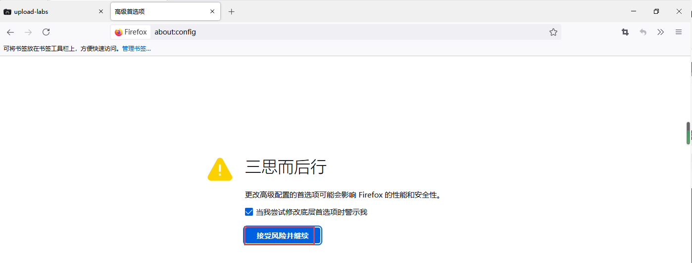

# 前端绕过

## 漏洞原理

Web应用系统虽然对用户上传的文件进行了校验，但是校验是通过前端JavaScript代码完成的。由于恶意用户可以对前端JavaScript进行修改或者是通过抓包软件篡改上传的文件，就会导致基于js的校验很容易被绕过。

## 判断是否存在前端js绕过漏洞：

按F12(或者:在网页空白处"右击"-->选择:"检查")打开调试面板，选择网络，然后上传图片文件和非图片文件，然后对这两个文件的变化进行对比，如果网络中没有数据变化，说明存在js前端验证漏洞，如果有变化说明不存在。(有变化说明，前端没有做验证，是把文件传输到后台，在后台进行验证的，所以才会有网络请求。)
以下我们以upload-labs靶场第一关为例

 

我们先打开网络

然后首先尝试传入一张照片


正常通过后会出现请求

如果，当我们上传非图片文件的时候，如果网络中未出现变化，但是出现报错，说明存在前端检测，例如：


如果网络中出现变化，然后报错，就说明是在后端也就是服务器进行检测，例如：


 这里要讨论的就是第二种情况前端检测

## 绕过方法1：删除或者禁用js：

在输入框中输入`about:config`点击`接受`




2、在搜索框中输入`javascript`然后找到`javascript.enabled`选项`双击`，出现`false`:


 

这里我们就禁用掉了js

返回靶场，我们重新进行上传，这次我们直接上传webshell

构建一个webshell.php

```
<?php @eval($_POST[123]);?>
```

进行上传

右键检查上传的文件路径


访问webshell


访问成功，蚁剑链接

## 绕过方法2：使用bp上传文件

上传规定后缀的webshell，打开bp拦截

拦截后，将文件名后缀改成php


同样上传成功

